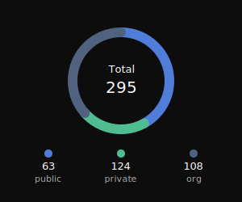
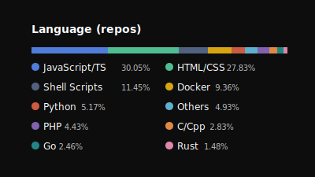
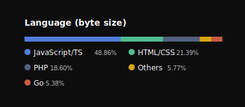

# 👋 Welcome

Hi, I'm **Rizal Ardhi Rahmadani** — a **Fullstack Developer** and **Senior Backend Engineer**, experienced in **GCP** and **AWS** cloud environments.  
Currently working full-time at [Trihaka](https://trihaka.id), and occasionally taking short freelance projects in my spare time.

---

## ⚡ GitHub Performance

---

## 💻 Languages Overview
Generated using my own project — [github-private-stats](https://github.com/reyzeal/github-private-stats).

### Total Repositories

### Top Languages by Repo Count

### Top Languages by Size

---

## 🧰 Tech Stack

**Languages:** TypeScript, JavaScript, Rust, Go, Python

**Backend:** Node.js, Bun, Express, Actix, Gin

**Frontend:** React, Solid, Tailwind CSS

**Databases:** MongoDB, Redis

**Messaging or Queue:** RabbitMQ, MQTT, FCM, SNS/SQS

**Tools:** GitHub Actions, Cloud Build, Terraform

**Cloud and DevOps:** Google Cloud Platform (GCP), Amazon Web Services (AWS), Docker, Cloud Run, Lambda  

---

> "First, solve the problem. Then, write the code. — John Johnson"
