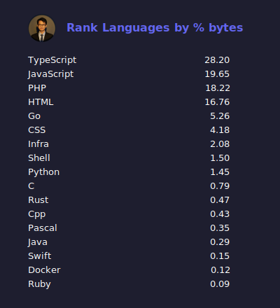

# 👋 Welcome

Hi, I'm **Rizal Ardhi Rahmadani** — a **Fullstack Developer** and **Senior Backend Engineer**, experienced in **GCP** and **AWS** cloud environments.  
Currently working full-time at [Trihaka](https://trihaka.id), and occasionally taking short freelance projects in my spare time.

---

## ⚡ GitHub Performance

---

## 💻 Languages Overview

**Total Repositories (Public + Private + Org):** 293 _(108 from org)_  
Generated using my own project — [github-private-stats](https://github.com/reyzeal/github-private-stats).

### Top Languages by Presence

### Top Languages by Size

---

## 🧰 Tech Stack

**Languages:** TypeScript, JavaScript, Rust, Go, Python  
**Backend:** Node.js, Bun, Express, Actix, Gin  
**Frontend:** React, Solid, Tailwind CSS  
**Databases:** MongoDB, Redis
**Cloud & DevOps:** Google Cloud Platform (GCP), Amazon Web Services (AWS), Docker, Cloud Run, Lambda  
**Messaging & Queue:** RabbitMQ, MQTT, SNS/SQS  
**Tools:** GitHub Actions, Cloud Build, Terraform

---

> “Code is like humor. When you have to explain it, it’s bad.” — Cory House
